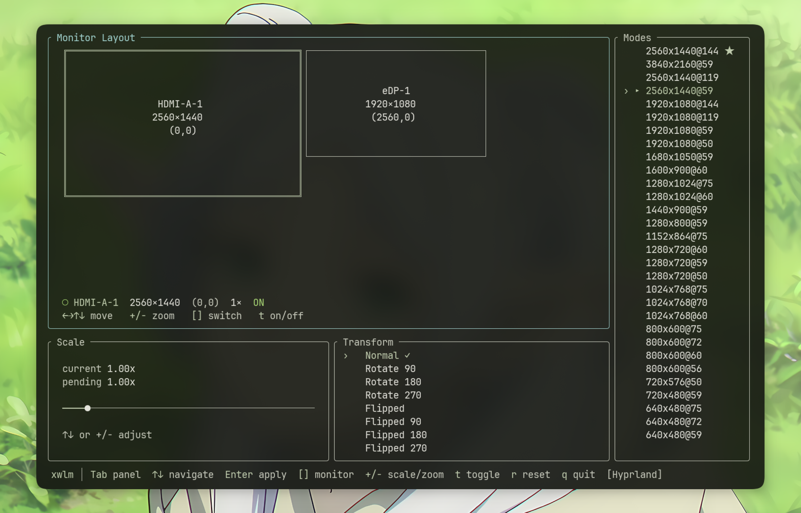

# xwlm

A TUI for managing your Wayland monitors. Supports Hyprland, Sway, and River.



## About

xwlm lets you arrange, resize, rotate, and toggle your monitors from the terminal. It auto-detects your compositor, reads the current monitor state over Wayland, and writes native config files when you apply changes.

No more hand-editing `monitors.conf`.

## Install

**From source:**
```sh
git clone https://github.com/x34-dzt/wlx_monitor_tui.git
cd wlx_monitor_tui
cargo build --release
# binary is at target/release/xwlm
```

**crates.io:**
```sh
cargo install wlx_monitor_tui
```

**AUR:**
```sh
yay -S xwlm
```

Then just run `xwlm`. On first launch it'll ask where to save your monitor config.

## Keybindings

| Key | Action |
|-----|--------|
| `Tab` | Switch panel |
| `[` `]` | Switch monitor |
| `Arrow keys` | Move monitor / navigate |
| `Enter` | Apply changes |
| `+` `-` | Adjust scale or zoom |
| `t` | Toggle on/off |
| `r` | Reset positions |
| `q` | Quit |

## Requirements

- Wayland session (Hyprland, Sway, or River)
- Terminal with Unicode support

## License

MIT
